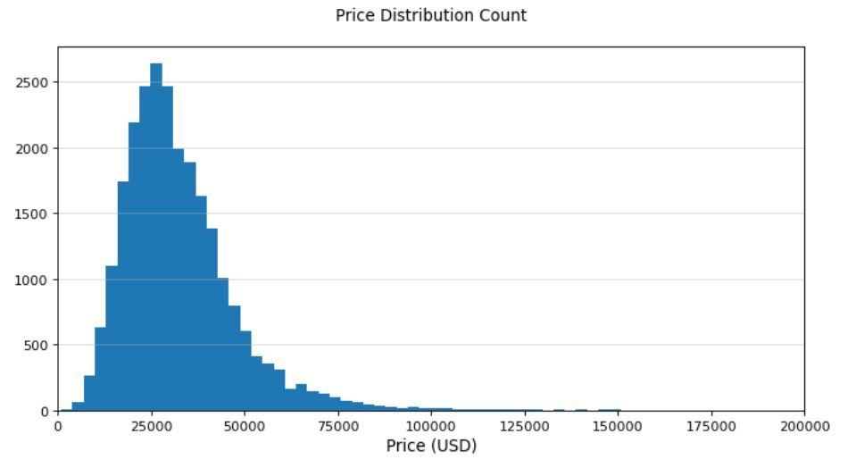

## Used Car Price Listing Scraper & Price Prediction ##

### Introduction
From the onset of Coronavirus pandemic, the U.S used car market has seen unprecedented rate of increase in the second hand automobiles’ prices. This phenomenon is mainly attributed to two causes: decreased production by automakers due to microchip shortages and increased demand from consumers returning to work. With prices still surging fast, buying a car has become more difficult, as knowing the benchmark price is harder; I decided to build a price estimator for the potential buyers in the market who wish to know the base price for particular model and mileage.

 

  

  
  <em>Source: cargurus.com</em>

----

### Data 
All of the data has been scraped from [Cargurus](cargurus.com). It is one of the most widely used platforms for buying/selling used cars. 
Each row of the training data consists of 28 features and 1 target (Listed Price). Features include basic information about the vehicle including Model ID, MSRP, body type, transmission, include options and etc. 

----

### Summary
The project consists of three parts:

**1) Scraper that gathers listings of used and new cars**

**2) Feature Engineering, Model Training**
* Linear Regression
* Polynomial Regression
* Random Forest Regressor
* XGB Regressor
* Multilayer Perceptron

**3) Model Performance Analysis**

----

### Web Scraper 
**Used Car Scraper:** The goal is to collect used car listings on Cargurus. We would like our lists to include the inventories of various brands, models, types and seller states. First, using [uszipcode API](https://uszipcode.readthedocs.io/index.html), generate shuffled list of zipcodes of largest states in the U.S by population. The assumption is that in the areas with greater population, we will observe more supplies of automobiles with diverse types. It fetches information of automobiles listed on each search page. In my notebook, I searched 1000 pages.

**MSRP Scraper:** Later I realized that nearly 70% of the inventories were missing the MSRP (manufacturer's suggested retail price) which is crucial in estimating our target. Accordingly, I added a scraper function that fetches MSRP for each model. 

----

### EDA
&nbsp;

  

We can see that the price range is centered around $30,000 with mean price of $32,000 and median price of $29,500.

&nbsp;

  

----

### Feature Engineering

